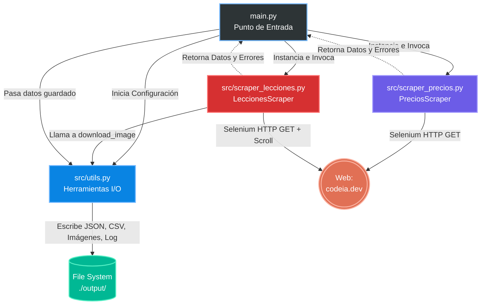

# 📊 Informe de Auditoría y Análisis del Código: `founders25-scraper`

**(Generado por el Agente Analista/Auditor)**

Este informe detalla la arquitectura, dependencias y lógica de negocio del repositorio objetivo, así como el análisis profundo necesario para su futura replicación y modularización.

---

## 1. Fase 1: Reconocimiento (Arquitectura y Dependencias)

### 1.1 Stack Tecnológico y Dependencias
El proyecto está desarrollado en Python y utiliza un enfoque mixto de requests HTTP simples y automatización del navegador (Selenium) para manejar contenido dinámico y estático.

| Tecnología / Librería | Versión | Propósito General en la Arquitectura                           |
| :-------------------- | :-----: | :------------------------------------------------------------- |
| **Python**            |   3.x   | Lenguaje base del proyecto.                                    |
| `requests`            | 2.31.0  | Peticiones HTTP para descargas de imágenes.                    |
| `beautifulsoup4`      | 4.12.3  | Parseo sintáctico de HTML para extracción de datos.            |
| `lxml`                |  5.1.0  | Motor de parseo optimizado para BeautifulSoup.                 |
| `pandas`              |  2.2.0  | _(Instalado, no utilizado explícitamente en el código actual)_ |
| `Pillow`              | 10.2.0  | _(Instalado, potencial procesamiento de imágenes)_             |
| `selenium`            | 4.16.0  | Automatización del navegador para renderizar/extraer JS.       |
| `webdriver-manager`   |  4.0.1  | Gestión automática e instalación del driver de Chrome.         |

### 1.2 Estructura del Repositorio
Se identificó la siguiente estructura principal y modular:
*   `main.py`: Orquestador principal. Define directorios, instancia scrapers, guarda en JSON/CSV y genera reportes log.
*   `requirements.txt`: Archivo de configuración de dependencias.
*   `src/scraper_precios.py`: Extrae planes, precios y características de `codeia.dev/precios`. Usa Selenium + BeautifulSoup.
*   `src/scraper_lecciones.py`: Extrae títulos, atributos, metadata y descarga imágenes de cursos de `codeia.dev/lecciones`. Emplea Selenium para carga dinámica (scroll).
*   `src/utils.py`: Auxiliares de I/O, descargas de red, persistencia de CSV/JSON y armado de reportes textuales.

---

## 2. Fase 2: Análisis Profundo de Código y Lógica de Negocio

### 2.1 Lógica del Scraper
1.  **Orquestación**: Todo empieza en `main.py`, que unifica el manejo de logs (consola y archivo `scraper.log`).
2.  **Manejo de I/O**: `utils.py` gestiona de manera centralizada la creación de un directorio base `output/` con subcarpetas para datos e imágenes.
3.  **Extracción de Precios**:
    *   Inicia driver en modo "headless".
    *   Realiza parseo local buscando clases CSS/estructuras de DOM que simulan "cards de precios".
    *   Maneja excepciones a nivel de ítem para no frenar la totalidad de la extracción.
4.  **Extracción de Lecciones**:
    *   Usa inyección de Javascript vía Selenium (`window.scrollTo`) para desencadenar el renderizado perezoso (Lazy Loading) de las lecciones.
    *   Aplica descargas simultáneas de portadas de lecciones, normalizando nombres de archivos usando RegEx para omitir caracteres especiales y transformar a formato kebab-case.
5.  **Reportes y Exportación**: Genera tanto `json` como `csv`. También crea un histórico en texto plano `informe_YYYYMMDD_HHMMSS.txt`.

### 2.2 Gráfica Arquitectónica y Flujo de Datos
A continuación, se presenta la representación visual de la arquitectura (Diagrama de Flujo y Dependencias).

*(Nota sobre gráfica nanobanana 2: En este documento en formato Markdown puro interactuamos usando Mermaid para la estructura relacional)*

### 2.3 Hallazgos y Recomendaciones (Cumpliendo el patrón DRY de la Fase 3)
*   **Violaciones al DRY (Don't Repeat Yourself)**: Existe duplicidad directa del código al configurar e instanciar *ChromeDriver* en el bloque `setup_driver()` dentro de `scraper_precios.py` y `scraper_lecciones.py`. Ambos instancian y configuran Selenium de manera idéntica.
    *   *Plan de Acción (Developer & Arquitecto)*: Extraer la configuración del webdriver a un método centralizado en `utils.py` u otra clase común.
*   **Problemas de Portabilidad**: Se implementa una validación hardcodeada al binario local en MacOS (`/Applications/Google Chrome.app/...`). Si el proyecto se despliega en Linux o Windows usando un fallback, la configuración puede fallar. Recomiendo que el próximo módulo gestione esto dinámicamente o como variables de entorno.
*   **Gestión de Descargas de Red**: `requests` se usa de manera secuencial (bloqueando el hilo principal) en `download_image()`. Para gran volumen, es mejor usar `asyncio` o paralelismo por hilos.
*   **Líneas de Código (KLOC Limit)**: Todo el proyecto cumple la norma de mantener menos de 1000 líneas por un archivo. El módulo más largo, `scraper_lecciones.py`, contiene 225 líneas, lo que denota una excelente compactación modular.

---
**Status Final:** *Monitor de progreso: Fase 1 y Fase 2 completadas satisfactoriamente.*
